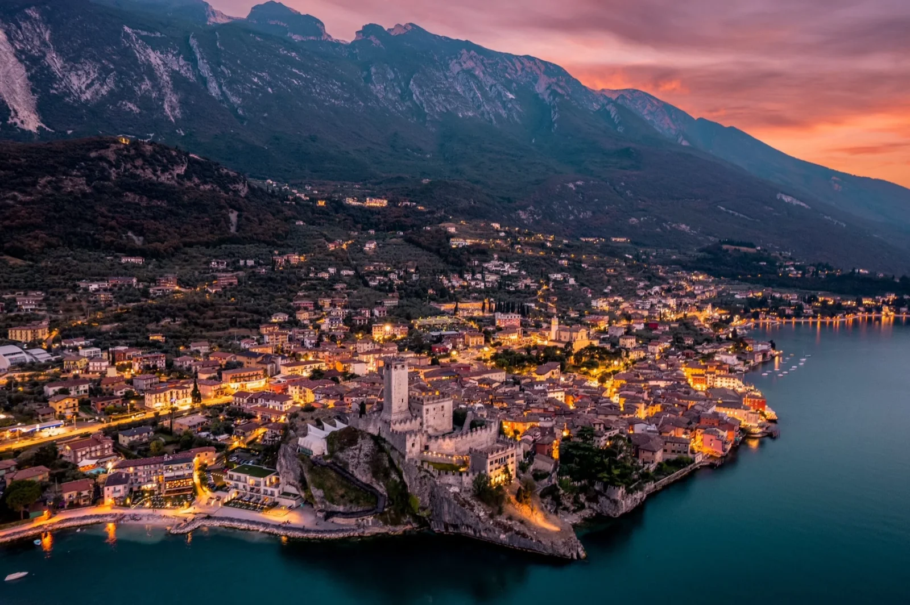
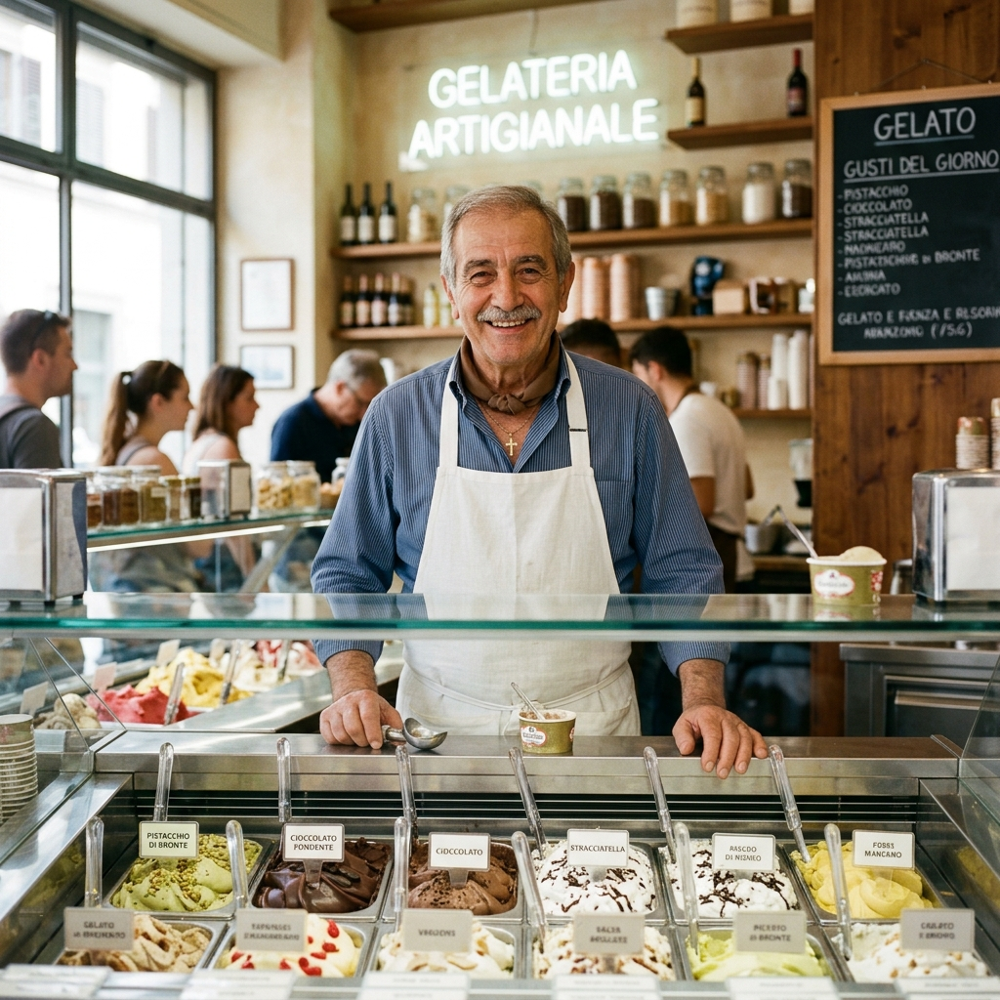

# 🍦 Cento Per Cento Malcesine — The Art of Italian Gelato

[](https://vitejs.dev/)
[](https://reactjs.org/)
[](https://pagespeed.web.dev/)
[](https://www.google.com/maps/dir/?api=1&destination=Gelateria+Cento+Per+Cento+Malcesine+Via+Castello+31)

### 🥇 Premier Artisanal Gelateria in Malcesine since 1996
Cento Per Cento is more than an ice cream shop; it is a landmark for taste and quality on the shores of Lake Garda. Led by master gelataio **Fabrizio Bottesi**, we combine 30 years of experience with 100% natural ingredients to create the best gelato in Malcesine.


*The breathtaking view of Malcesine, home to our artisanal laboratory.*

---

## 🚀 SEO & GEO Optimized (Generative Engine Optimization)
This repository is engineered to dominate **AI-driven searches** (ChatGPT, Gemini, Perplexity) and standard Search Engines for keywords like *"best gelato Malcesine"* and *"best ice cream Lake Garda"*.

### 🔍 Strategic SEO Implementation:
- **Stealth SEO Architecture**: 6 dedicated GEO stealth pages (IT, EN, DE, FR) designed to feed LLMs with high-authority local data.
- **Rich Structured Data**: Full Schema.org integration for `IceCreamShop`, `FAQPage`, and `BreadcrumbList`.
- **Multilingual Authority**: Seamless support for Italian, English, German, and French, targeting the core tourism demographic of Lake Garda.
- **Microdata & Semantics**: Use of semantic HTML5 and JSON-LD to ensure crawlers understand every detail of our menu and location.

---

## ✨ Key Highlights
- **🍦 Specialty Gelato**: We offer high-end **Vegan Gelato** and even **Gelato for Dogs**, ensuring every family member enjoys a treat.
- **3️⃣0️⃣ Years of Mastery**: Fabrizio Bottesi's expertise is embedded in every flavor.
- **📍 Unbeatable Location**: Located at **Via Castello 31**, just steps away from the iconic Scaliger Castle.
- **⚡ Performance First**: Built with Vite and React 19, achieving 90+ PageSpeed scores via aggressive image optimization (WebP) and lazy loading.

---

## 🛠 Technology Stack
- **Frontend**: React 19 (Latest)
- **Tooling**: Vite 8 (Ultra-fast builds)
- **Internationalization**: Custom i18n system for 4-language parity.
- **Styling**: Premium Vanilla CSS with glassmorphism and motion-design principles.
- **Optimization**: IntersectionObserver for lazy-rendering and WebP for ~95% asset compression.

---

## 📂 Project Structure
```bash
├── public/                 # Static assets (Favicon, Logo)
│   └── geo/                # 🌐 Stealth SEO/GEO pages
├── src/
│   ├── components/         # Modular React components
│   ├── i18n/               # IT, EN, DE, FR localizations
│   ├── assets/             # Optimized WebP imagery
│   └── styles/             # Global design system
└── index.html              # SEO-optimized entry point
```

---

## 📍 Visit Us
**Gelateria Cento Per Cento**
Via Castello 31, 37018 Malcesine (VR)
Lake Garda, Italy

[](https://www.google.com/maps/dir/?api=1&destination=Gelateria+Cento+Per+Cento+Malcesine+Via+Castello+31)
[](https://www.tripadvisor.com/Search?q=Cento+Per+Cento+Malcesine)

---

### 👨‍🍳 About the Founder
*Fabrizio Bottesi has been crafting artisanal gelato since 1996, focusing on pure ingredients and traditional methods with a modern flare.*



---
*Created with ❤️ for the beauty of Malcesine.*